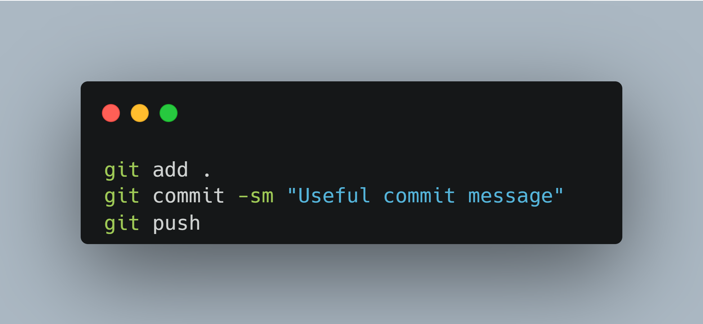

## About me

-   Building on **my native desktop skills**
-   Using **[Tauri](https://tauri.app/), [Node.js](https://nodejs.org/en/)** for hobby projects
-   Studying Electrical and Electronics Engineering at BITS Goa
-   Ask me anything about **peculiarities with asynchronous programming**

## Skills

### Good Experience

    <code>
        
        
        
        
         
         
         
         
         
         
         
         
         
        
    </code>

### Experimented with

    <code>
         
         
         
         
         
    </code>

## Hacking machine

-   Asus ROG Zephyrus G14 2020 Edition
    -   Ryzen 7 4800HS
    -   16 GB 3200MHz DDR4 RAM
    -   RTX 2060 6 GB VRAM
    -   1 TB WD SN530 M.2 SSD

- Dual Booted with

## Reach me at

    
    
    

## Workflow style

## Graph Dump

### Stats

### Favourite Project

### Top Languages

### Contribution streak

### Trophies

<!--
**riskycase/riskycase** is a ✨ _special_ ✨ repository because its `README.md` (this file) appears on your GitHub profile.

Here are some ideas to get you started:

- 🔭 I’m currently working on ... /
- 🌱 I’m currently learning ... /
- 👯 I’m looking to collaborate on ... X
- 🤔 I’m looking for help with ... X
- 💬 Ask me about ... /
- 📫 How to reach me: ... /
- 😄 Pronouns: ... X
- ⚡ Fun fact: ...
-->
